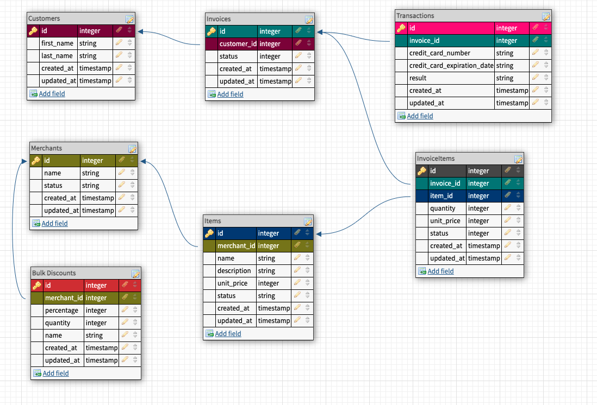

# Bulk Discounts

## Table of Contents

- [Background and Description](#background-and-description)
- [Learning Goals](#learning-goals)
- [Phases](#phases)
- [Database Schema](#database-schema)
- [Overview](#overview)
- [Tools Used](#tools-used)
- [Contributors](#contributors)

## Background and Description

This project is an extension of the Little Esty Shop group project. You will add functionality for merchants to create bulk discounts for their items. A “bulk discount” is a discount based on the quantity of items the customer is buying, for example “20% off orders of 10 or more items”.

## Learning Goals
- Write migrations to create tables and relationships between tables
- Implement CRUD functionality for a resource using forms (form_tag or form_with), buttons, and links
- Use MVC to organize code effectively, limiting the amount of logic included in views and controllers
- Use built-in ActiveRecord methods to join multiple tables of data, make calculations, and group data based on one or more attributes
- Write model tests that fully cover the data logic of the application
- Write feature tests that fully cover the functionality of the application

## Phases

1. [Database Setup](./doc/bulk_discounts_examples.md)
1. [User Stories](./doc/bulk_discounts_user_stories.md)
1. [Extensions](./doc/bulk_discounts_extensions.md)
1. [Evaluation](./doc/bulk_discounts_evaluation.md)

## Database Schema

## Overview

Bulk Discounts is a week long individual project during Mod 2 of Turing School's Back-End Engineering program.

The goal was to create add discounts to an already functioning Rails Application that can take users through a website and give them the ability to use CRUD commands to Create, Read, Update, and Destroy data while being able to view the changes on the website(Rails Application).

One challenge with this project was deciding the best methods to calculate discounted revenue and which ActiveRecord queries would best accomplish this task while using as little Ruby as possible. 

## Tools Used

| Development | Testing       | Gems            |
|   :----:    |    :----:     |    :----:       |
| Ruby 2.7.2  | RSpec         | SimpleCov       |
| Rails       |               | Pry             |
| HTML5       |               | Capybara        |
| CSS3        |               | ShouldaMatcher  |
| Atom        |               | Launchy         |
| Github      |               | Orderly         |
|             |               | Factorybot/Faker|

## Contributors

👤  **Amanda McGuire**
- [GitHub](https://github.com/amcguire17)
- [LinkedIn](https://www.linkedin.com/in/amanda-e-mcguire/)

[Little Esty Shop Details](./doc/little-esty-shop-README.md)
